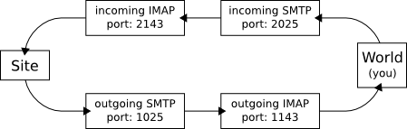

# Chcem vediet

Chcem vedieť -- Slovak for "I want to know" -- a server to ease access to information under the
[Slovak Freedom Of Information Act 211/2000 Coll](http://www.urzd.sk/legislativa/211-00-en.pdf).

## 1. Local Development Server

To develop and test the site locally on your computer you don't need any real webserver, database,
nor mail server. They are simulated by the testing environment.

Please make sure you won't push any autogenerated files to the git repository, such as your local
`env/` directory or `test.db` and `*.pyc` files.

### 1.1. Dependencies

You need the following packages installed
 * python (ver. 2.7.x)
 * python-virtualenv

### 1.2. Installation

To prepare your local development environment, run the following commands:

	$ git clone https://github.com/martinmacko47/chcemvediet.git
	$ cd chcemvediet
	$ virtualenv env
	$ env/bin/pip install -r requirements-dev.txt
	$ env/bin/python configure.py
	$ env/bin/python manage.py syncdb --all --noinput
	$ env/bin/python manage.py migrate --fake
	$ env/bin/python manage.py loaddata fixtures/*.json

Configuration script `configure.py` will ask you to input several options. Please follow the script
instructions. Among other things it will ask for your OAuth Client IDs and Secrets for social
account providers. See [Social accounts application keys](#3-social-accounts-application-keys)
section bellow for details how to get social accounts application keys. The script will ask you
whether you wish to configure just local dummy e-mail infrastructure, or you wish to end real
e-mails via Mandrill. For details on the dummy e-mail infrastructure see [Dummy e-mail
infrastructure](#5-dummy-e-mail-infrastructure) section, and for instructions how to setup Mandrill
see [Mandrill transactional e-mail servis](#4-mandrill-transactional-e-mail-servis) section below.

### 1.3. Updates

You should update your development environment regularly to reflect the changes made by other
developers. To update the environment, you can delete it and recreate it from the scratch again, or
you can migrate it. Migrations are useful if you've got some unfinished work you have not pushed to
the repository, yet. However, you should recreate your environment from the scratch once in
a while, as the migrations are not waterproof and may fail sometimes, especially if migrating from
a rather old environment.

To migrate to an updated version of the site, run the following commands:

	$ cd chcemvediet
	$ git pull
	$ env/bin/pip install -r requirements-dev.txt
	$ env/bin/python configure.py
	$ env/bin/python manage.py syncdb --noinput
	$ env/bin/python manage.py migrate

If `migrate` fails, try to run it once or twice again. Sometimes it helps.

### 1.4. Viewing the site

 1. Run testing webserver:

    	$ env/bin/python manage.py runserver

 2. Run dummy mail infrastructure in another shell if you have configured your installation to use
    it. If you have configured to use Mandrill or not to use any email infrastructure at all, don't
    run this command:

    	$ env/bin/python manage.py dummymail

 3. Run testing cronserver in yet another shell:

    	$ env/bin/python manage.py cronserver

 4. Now, you can navigate your browser to: http://127.0.0.1:8000/ and start using it.

## 2. Production Server

We run production server on Apache using `mod_wsgi` and MySQL database.

### 2.1. Dependencies

You need the following packages installed
 * apache2 (ver. 2.2.x)
 * mysql-server (ver. 5.5.5+)
 * python (ver. 2.7.x)
 * python-virtualenv
 * python-dev
 * libmysqlclient-dev
 * libapache2-mod-wsgi

### 2.2. Installation

To prepare your server environment, run the following commands:

	$ git clone https://github.com/martinmacko47/chcemvediet.git
	$ cd chcemvediet
	$ virtualenv env
	$ env/bin/pip install -r requirements-prod.txt
	$ env/bin/python configure.py
	$ env/bin/python manage.py syncdb --all --noinput
	$ env/bin/python manage.py migrate --fake
	$ env/bin/python manage.py loaddata fixtures/*.json

In configuration script `configure.py` select online development server mode or production server
mode. The only difference is that online development server mode has enabled some debug options
that can be usefull during pre-alpha testing. In addition to questions asked in local development
mode, the script will ask you to enter production database credentails.

### 2.3. Apache Configuration

Make sure `mod_wsgi` Apache module is installed and enabled and add the following directives to
your virtualhost configuration:

	ServerName {domain}

	...

	WSGIScriptAlias / {path}/chcemvediet/chcemvediet/wsgi.py
	WSGIDaemonProcess {domain} user={user} group={group} python-path={path}/chcemvediet:{path}/chcemvediet/env/lib/python2.7/site-packages
	WSGIProcessGroup {domain}

	<Directory {path}/chcemvediet/chcemvediet>
	  <Files wsgi.py>
	    Order allow,deny
	    Allow from all
	  </Files>
	</Directory>

Where `{path}` is an absolute path to the repository, `{domain}` is your web domain and `{user}`
and `{group}` are unix user and group names the server will run under.

## 3. Social accounts application keys

### 3.1. Google OAuth

 1. Go to https://code.google.com/apis/console/ and create a project.

 2. Select the project, click on 'APIs & auth' / 'Credentials' and 'Create new Client ID' with the
    following options:
      * Application type: Web application
      * Authorized JavaScript origins: `http://{domain}/`
      * Authorized redirect URI:
        	http://{domain}/accounts/google/login/callback/
        	http://{domain}/sk/accounts/google/login/callback/
        	http://{domain}/en/accounts/google/login/callback/
    Where `{domain}` is your production domain or `127.0.0.1:8000` if in local development mode.

 3. Run the configuration script `configure.py` and enter given 'Client ID for web application' and
    'Client secret'.

## 4. Mandrill transactional e-mail servis

To use Mandrill, you need to register on their site http://mandrill.com/ and obtain a Mandrill API
key. The configuration script `configure.py` will ask for this key.

To let Mandrill process your inbound e-mails, you must configure your inbound e-mail addresses to
reside on domains you control. The configuration script will ask you to input your admin e-mail,
your default from e-mail and your inforequest unique email template. For every domain you use with
these addresses, you must add MX DNS records as required by Mandrill. For details see
https://mandrillapp.com/inbound. Note that obligee emails should not reside on domains you
configured to use with Mandrill.

To setup Mandrill webhook you need an URL Mandrill server can access. If you will be running your
server behing a firewall or NAT, you need to setup a tunelling reverse proxy to your localhost. See
https://ngrok.com/ for instance. The configuration script will ask for your webhook prefix. For
instance, if using ngrok, your prefix should look like `https://<yoursubdomain>.ngrok.com/`.
After you input the webhook prefix, the script will give you a full URL you are to use to configure
your Mandrill webhook. To configure the webhook, go to https://mandrillapp.com/inbound and add
a route pointing to this URL for every inbound domain. Note that in order to add a route your
server must be up and running, so for now skim the rest of the configuration script, run the
server, setup the route and run the configuration script once again to input remaining options.

After you have added your webhook, go to https://mandrillapp.com/settings/webhooks and add
a webhook to trigger on the following events: `send`, `deferral`, `hard_bounce`, `soft_bounce`,
`open`, `click`, `spam` and `reject`. Finally, copy the keys of all your webhooks and input them
into the configuration script and restart the server.

## 5. Dummy e-mail infrastructure

Using the command:

	$ env/bin/python manage.py dummymail

you can create a dummy e-mail infrastructure for local development. For help on command options
run:

	$ env/bin/python manage.py help dummymail

This command runs two pairs of dummy SMTP and IMAP servers on localhost. One pair is for outgoing
mails and one for incoming mails. By default, outgoing SMTP server runs on port number 1025,
incoming SMTP server on port number 2025, outgoing IMAP server on port number 1143 and incoming
IMAP server on port number 2143. You may change these port numbers with options.

  

During the development, you may use this infrastructure to simulate the site communication with the
outside world with no risk of sending any real e-mails to the outside world. In this setting, the
outside world will be represented by you, the site developer and/or tester. This means that all
e-mails sent from the site will be delivered to your IMAP client instead of their real destination.

The site sends its outgoing mails to the outgoing SMTP server and fetches its incoming mails from
the incoming IMAP server. On the other side, if you (representing the outside world) want to send
an email to the site, you have to send it to the incoming SMTP server. If you want to read the
mails sent by the site, you should fetch them from the outgoing IMAP server. Never try to connect
to outgoing SMTP server nor the incoming IMAP server. Only the site should connect to them. We run
two separate pairs of SMTP and IMAP servers in order to make sure the messages from the site will
not confuse with the messages from the outside world.

You may use any common IMAP e-mail client to connect to the incoming SMTP server and the outgoing
IMAP server. However, some e-mail clients (e.g. Thunderbird) get confused when the server
infrastructure restarts and refuse to fetch the messages any more. Restarting the client should
help. Sometimes, some clients (e.g. Thunderbird) refuse to fetch some messages for no apparent
reason, especially the first message. In such case, try some other client, or try to send the
message once again. The password for both the incoming SMTP server and the outgoing IMAP server is
`aaa`.

Note: No real e-mails are sent anywhere. The SMTP server is dummy and will never relay any received
message to any other SMTP server. Instead, it will store it locally in the memory and make it
available via dummy IMAP server. So, it's safe to send any message, from any e-mail address to any
e-mail address whatsoever. Nothing will be delivered. Also note, that all e-mails are stored in the
memory only, so they will disappear when the infrastructure is restarted.

## 6. Contributing

If you want to contribute, please, create a new branch for your changes:

	$ git checkout -b <new_branch_name>
	$ git commit
	$ git push -u origin <new_branch_name>

And then submit a 'Pull Request' on GitHub.

### 6.1. Site Content and translations

All site text content is stored in templates. Templates are in `template` directories all over the
project. Some templates are translated in place and have their translated versions such as
`about.sk.html` and `about.en.html`. Some templates are not translated in place and have only one
english version, e.g. `header-menu.html`. All translatable text from templates that are not
translated in place is exported into the localization `*.po` file stored in `locale` directory. As
a rule, templates with lots of text but no structrure are translated in place and templates with
lots of structure but short on text are translated via the localization file.

Templates with their own translated versions can be edited directly. Editing templates with no
in place translation is a bit more complicated. To change the Slovak translation of such template,
open localization file `locale/sk/LC_MESSAGES/django.po`, find the translations, edit them and
compile them:

	$ cd chcemvediet/chcemvediet
	$ ../env/bin/python ../manage.py compilemessages

To change the English translation of such template, foremost, change the English text directly in
the template and regenerate the localization file:

	$ cd chcemvediet/chcemvediet
	$ ../env/bin/python ../manage.py makemessages -l sk

Then update respective Slovak translations in the localization file and compile them. Don't forget
to commit and push your changes to the repository.

